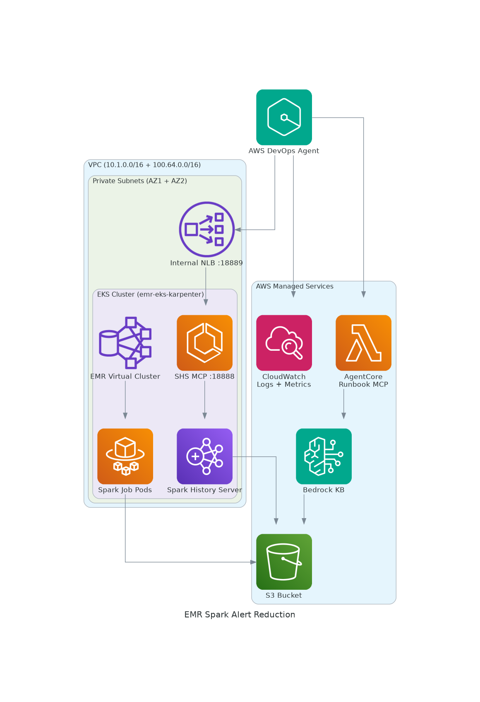
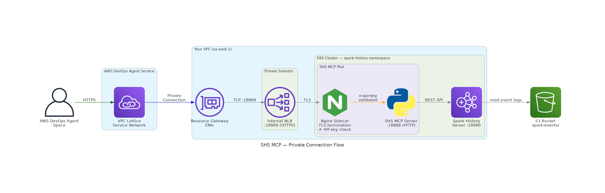
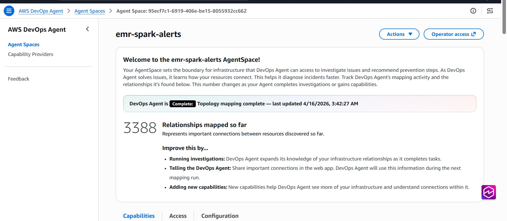
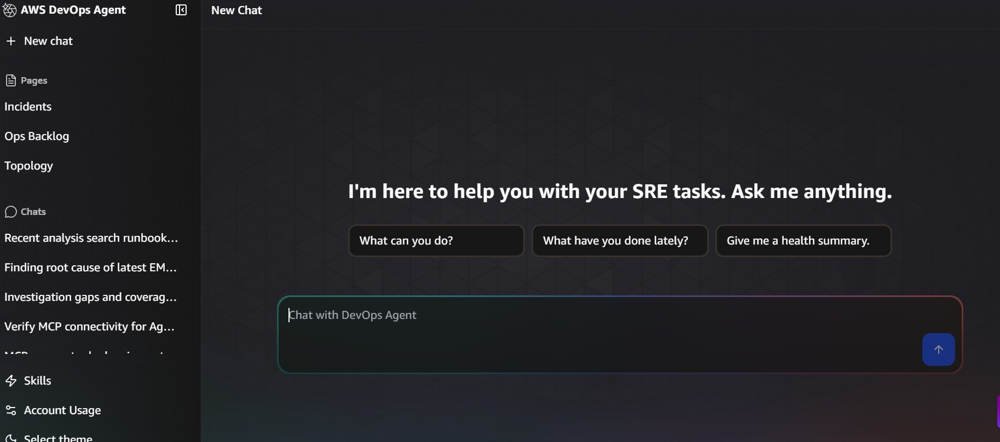

# AWS DevOps Agent: Investigate Amazon EMR on Amazon EKS Spark Job Failures

A hands-on sample showing how to use [AWS DevOps Agent](https://aws.amazon.com/devops-agent/) to investigate Spark job failures on Amazon EMR on Amazon Elastic Kubernetes Service (Amazon EKS). You deploy an Amazon EMR on Amazon EKS environment with two custom MCP servers, inject real Spark failures (OOM, schema errors, data skew, bad Amazon S3 paths), and use the agent to find the root cause with natural language prompts.

> **🚀 Quick Start:** You'll need an Amazon EMR on EKS cluster first (use your own, or deploy one in [Step 0](#step-0-amazon-emr-on-eks-cluster)). Then run `./deploy.sh` to set up the rest in ~15-20 minutes.

## Table of Contents

- [Walkthrough](#walkthrough)
- [What You'll Learn](#what-youll-learn)
- [Solution Architecture](#solution-architecture)
- [MCP Server Connectivity Options](#mcp-server-connectivity-options)
- [Getting Started](#getting-started)
- [AWS DevOps Agent Configuration](#devops-agent-configuration)
- [Fault Injection Labs](#fault-injection-labs)
- [Sample Spark Jobs](#sample-spark-jobs)
- [Cost](#cost)
- [Cleanup](#cleanup)
- [Security Considerations](#security-considerations)
- [Troubleshooting](#troubleshooting)
- [Additional Resources](#additional-resources)

## Walkthrough

1. **Deploy** the Amazon EMR on EKS environment with Spark History Server and two custom MCP servers (Runbook MCP, Spark History Server MCP)
2. **Inject** a fault by submitting a broken PySpark job
3. **Investigate** with AWS DevOps Agent. It looks at Amazon CloudWatch Logs, Spark execution data (SHS MCP), and operational runbooks (Runbook MCP) to find what went wrong
4. **Fix** by running the rollback script to submit a working job

## What You'll Learn

- How to build and deploy custom MCP servers for AWS DevOps Agent
- How AWS DevOps Agent pulls together Spark execution data, Amazon CloudWatch Logs, and runbooks to diagnose OOM, data skew, schema errors, and config problems

> **⚠️ Disclaimer:** This repo includes scripts that intentionally break Spark jobs to demo AWS DevOps Agent. **Don't run these in production.** See [Security Considerations](docs/SECURITY_CONSIDERATIONS.md) before adapting for production.

## Solution Architecture



### Private Connection — SHS MCP Flow

The SHS MCP server runs inside the Amazon EKS cluster on a private subnet. AWS DevOps Agent reaches it through a VPC Lattice Private Connection — no public internet exposure.



This workshop deploys the following components:

| Component | What It Does | Where It Runs |
|-----------|-------------|---------------|
| **Amazon EMR on EKS** | Runs Spark jobs on Kubernetes. Spark event logs go to Amazon S3. stdout/stderr and per-container logs go to Amazon CloudWatch Logs (`/emr-on-eks/dev`). | Amazon EKS cluster (`emr-eks-karpenter`) |
| **Amazon CloudWatch metrics (Amazon EMR on EKS)** | AWS automatically publishes Amazon EMR on EKS service-level metrics (job run counts, container state) under the `AWS/EMRContainers` namespace. | Amazon CloudWatch |
| **Amazon Managed Service for Prometheus** | Prometheus running on Amazon EKS scrapes pod and node metrics (CPU, memory, network) and ingests them into Amazon Managed Service for Prometheus. Enabled by default in the data-on-eks blueprint. | Amazon Managed Service for Prometheus workspace |
| **Spark History Server (SHS)** | Reads Spark event logs from Amazon S3 and serves a REST API with job execution details (stages, tasks, executors, shuffle metrics). | Amazon EKS pod (`spark-history` namespace) |
| **SHS MCP Server** (18 tools) | Wraps the SHS REST API as an MCP server so AWS DevOps Agent can query Spark execution data. Runs as a sidecar alongside SHS. | Amazon EKS pod with Nginx sidecar for TLS + API key auth |
| **Runbook MCP Server** (3 tools) | Searches operational runbooks indexed in an Amazon Bedrock Knowledge Base. Returns step-by-step investigation guides for known failure patterns (what to check, in what order). | Amazon Bedrock AgentCore Runtime (managed HTTPS endpoint) |
| **Amazon Bedrock Knowledge Base** | Indexes 7 YAML runbooks (OOM, data skew, shuffle errors, scheduling failures, etc.) stored in Amazon S3, using Amazon OpenSearch Serverless as the vector store. | Amazon Bedrock + Amazon OpenSearch Serverless |
| **AWS DevOps Agent** | Connects to all the above sources (Amazon CloudWatch Logs and Amazon CloudWatch metrics built-in, SHS MCP via Private Connection, Runbook MCP via Amazon Bedrock AgentCore Runtime) and investigates Spark job failures with natural language. Amazon Managed Service for Prometheus metrics aren't directly queried by the agent in this sample. | AWS DevOps Agent console |

## MCP Server Connectivity Options

AWS DevOps Agent requires HTTPS with authentication for all MCP servers. This sample deploys MCP servers in two diffeent ways and demonsrates how to Integrate them with AWS Devops Agent.

### Runbook MCP: Exposed via Amazon Bedrock AgentCore Runtime (OAuth) 
The Runbook MCP server is deployed to Amazon Bedrock AgentCore , which hosts it as a managed HTTPS endpoint. AWS DevOps Agent authenticates with an OAuth 2.0 Client Credentials token from Amazon Cognito.

### SHS MCP: Exposed via EKS.
The SHS MCP server runs as a pod inside the Amazon EKS cluster, exposed via an Internal Network Load Balancer. AWS DevOps Agent connects through Amazon VPC Lattice as MCP Server is not exposed over Internet.


See the [Solution Architecture diagram](docs/images/architecture.png) for the full connectivity picture. SHS MCP needs separate VPC lattice connectivity as it is not exposed over Internet.


## Getting Started

### Prerequisites

| Tool | Install | Docs |
|------|---------|------|
| AWS CLI | `curl "https://awscli.amazonaws.com/awscli-exe-linux-x86_64.zip" -o "awscliv2.zip" && unzip awscliv2.zip && sudo ./aws/install` | [Install AWS CLI](https://docs.aws.amazon.com/cli/latest/userguide/getting-started-install.html) |
| Terraform | `sudo yum install -y yum-utils && sudo yum-config-manager --add-repo https://rpm.releases.hashicorp.com/AmazonLinux/hashicorp.repo && sudo yum -y install terraform` | [Install Terraform](https://developer.hashicorp.com/terraform/install) |
| kubectl | `curl -LO "https://dl.k8s.io/release/$(curl -L -s https://dl.k8s.io/release/stable.txt)/bin/linux/amd64/kubectl" && sudo install kubectl /usr/local/bin/` | [Install kubectl](https://kubernetes.io/docs/tasks/tools/install-kubectl-linux/) |
| Helm | `curl https://raw.githubusercontent.com/helm/helm/main/scripts/get-helm-3 \| bash` | [Install Helm](https://helm.sh/docs/intro/install/) |
| jq | `sudo yum install -y jq` or `sudo apt-get install -y jq` | [Install jq](https://jqlang.github.io/jq/download/) |
| openssl | Pre-installed on most Linux/macOS | [OpenSSL](https://www.openssl.org/source/) |
| Node.js 18+ | `curl -fsSL https://rpm.nodesource.com/setup_18.x \| sudo bash - && sudo yum install -y nodejs` | [Install Node.js](https://nodejs.org/en/download/) |
| AgentCore CLI | `sudo npm install -g @aws/agentcore typescript` | [AgentCore CLI](https://docs.aws.amazon.com/agentcore/latest/userguide/get-started-cli.html) |

Configure AWS credentials:

```bash
aws configure
```

> **Regions:** The Terraform blueprint defaults to `us-west-2`. AWS DevOps Agent Spaces are available in `us-east-1`, `us-west-2`, `ap-southeast-2`, `ap-northeast-1`, `eu-central-1`, and `eu-west-1`, and can monitor resources in any region. Your EKS cluster can be in any region. Set `AWS_REGION` in `config.env` to match your EKS cluster region.

### Step 0: Amazon EMR on EKS Cluster

You need an Amazon EKS cluster with Amazon EMR on EKS configured. Pick one option:

<details>
<summary><b>Option A: Use your existing Amazon EMR on EKS cluster</b></summary>

Gather these values from your existing setup:

```bash
aws eks list-clusters --region $AWS_REGION
aws emr-containers list-virtual-clusters --region $AWS_REGION --states RUNNING \
  --query "virtualClusters[].{Id:id,Name:name}" --output table
aws iam list-roles --query "Roles[?contains(RoleName,'emr-data-team-a')].Arn" --output text
```

Skip to [Step 1: One-Click Deployment](#step-1-one-click-deployment).

</details>

<details>
<summary><b>Option B: Deploy a new Amazon EMR on EKS cluster (~25-30 min)</b></summary>

Uses the [data-on-eks emr-eks-karpenter blueprint](https://awslabs.github.io/data-on-eks/docs/blueprints/amazon-emr-on-eks/emr-eks-karpenter):

```bash
git clone https://github.com/awslabs/data-on-eks.git
cd data-on-eks/analytics/terraform/emr-eks-karpenter

terraform init
terraform apply -auto-approve
# For a different region: terraform apply -auto-approve -var region=us-east-1
```

If Terraform fails partway through (usually Helm timing issues), run `terraform destroy -auto-approve` and try again.

Configure kubectl and verify:

```bash
export AWS_REGION=us-west-2
aws eks update-kubeconfig --name emr-eks-karpenter --region $AWS_REGION
kubectl get nodes
aws emr-containers list-virtual-clusters --region $AWS_REGION --states RUNNING \
  --query "virtualClusters[].{Id:id,Name:name}" --output table
```

You should see nodes running and two virtual clusters (`emr-data-team-a` and `emr-data-team-b`).

</details>

### Step 1: One-Click Deployment

```bash
git clone https://github.com/aws-samples/sample-devops-agent-emr-alertreduction.git
cd sample-devops-agent-emr-alertreduction

cp config.env.template config.env
# Edit config.env and set: EKS_CLUSTER_NAME, EMR_VIRTUAL_CLUSTER_ID,
# JOB_EXECUTION_ROLE_ARN, AWS_REGION (follow the commands in config.env)

./deploy.sh
```

The `deploy.sh` script runs these steps (~15-20 min):

1. Patch the Amazon EMR execution role with scoped Amazon CloudWatch Logs + Amazon S3 permissions (see `scripts/patch-emr-role.sh`)
2. Deploy the CloudFormation stack (Amazon S3 + Amazon OpenSearch Serverless + Amazon Bedrock Knowledge Base, hardened per `infrastructure/template.yaml`)
3. Upload runbooks to Amazon S3 and sync to Amazon Bedrock Knowledge Base
4. Deploy Spark History Server on Amazon EKS
5. Deploy Runbook MCP to Amazon Bedrock AgentCore Runtime (Cognito + OAuth) and SHS MCP on Amazon EKS via Helm + internal NLB

See [Security Considerations](docs/SECURITY_CONSIDERATIONS.md) for IAM policy details and S3 hardening.

<details>
<summary><b>Manual Step-by-Step Deployment</b></summary>

If you prefer to run each step manually:

```bash
bash scripts/patch-emr-role.sh          # Step 1: IAM patches
bash scripts/deploy-infra.sh            # Step 2: CFN + Amazon Bedrock Knowledge Base + runbooks
bash scripts/deploy-shs.sh              # Step 3: Spark History Server
bash scripts/deploy-mcp-server.sh       # Step 4: Runbook MCP → Amazon Bedrock AgentCore
bash scripts/deploy-shs-mcp-private.sh  # Step 5: SHS MCP via Helm + NLB
```

</details>

### Step 2: Verify Deployment

Check pods are running:

```bash
kubectl get pods -n spark-history
# Expected: spark-history-server (1/1) and shs-mcp-... (2/2)
```

Submit a baseline Spark job to confirm end-to-end flow:

```bash
bash fault-injection/rollback-submit-good-job.sh
# Should complete in ~50-90 seconds
```

Verify the job shows up in Spark History Server and CloudWatch Logs:

```bash
kubectl exec -n spark-history deploy/spark-history-server -- \
  curl -s http://localhost:18080/api/v1/applications

aws logs describe-log-streams --log-group-name "/emr-on-eks/dev" --region $AWS_REGION \
  --order-by LastEventTime --descending --limit 5 \
  --query "logStreams[].logStreamName" --output table
```

<details>
<summary><b>Additional verification checks</b></summary>

Browse the SHS Web UI (optional):

```bash
kubectl port-forward -n spark-history deploy/spark-history-server 18080:18080
# Open http://localhost:18080 in your browser (Ctrl+C to stop)
```

Verify Amazon Bedrock Knowledge Base returns runbooks:

```bash
KB_ID=$(aws bedrock-agent list-knowledge-bases --region $AWS_REGION \
  --query "knowledgeBaseSummaries[?starts_with(name,'dev-emr-runbooks-kb') && status=='ACTIVE'].knowledgeBaseId" --output text)
aws bedrock-agent-runtime retrieve --knowledge-base-id "$KB_ID" --region $AWS_REGION \
  --retrieval-query '{"text": "spark OOM failure"}' \
  --query "retrievalResults[0].content.text" --output text | head -5
```

Verify SHS MCP endpoint (retrieves the auto-generated API key from the Kubernetes Secret):

```bash
API_KEY=$(kubectl get secret shs-mcp-apikey -n spark-history \
  -o jsonpath='{.data.api-key}' | base64 -d)
kubectl exec -n spark-history deploy/shs-mcp-mcp-apache-spark-history-server -c nginx-auth-proxy -- \
  sh -c "curl -sk https://localhost:18889/mcp/ -H 'x-api-key: $API_KEY'"
```

</details>

## AWS DevOps Agent Configuration

Configure AWS DevOps Agent to access your EKS cluster and both MCP servers through the AWS console.

**1. Print all the values you'll need:**

```bash
bash scripts/show-setup-values.sh
```

This prints the NLB DNS, security group IDs, Cognito credentials, and everything else needed for the console.

**2. Create the Agent Space:** Follow [docs/AGENT_SPACE_SETUP.md](docs/AGENT_SPACE_SETUP.md) for step-by-step console instructions with commands to retrieve each value.

Once configured, your Agent Space should look like this (with both MCP servers registered). Click **Operator access** to launch the Web App:




## Fault Injection Labs

Four labs that simulate real Spark job failures. Each inject script uploads a broken PySpark script to Amazon S3, submits it to Amazon EMR on EKS, waits for it to finish, and prints the job run ID.

### Setup

```bash
cd fault-injection
chmod +x *.sh
```

### Labs at a Glance

| Lab | Failure | Inject | Rollback | Result |
|-----|---------|--------|----------|--------|
| 1. OOM | OutOfMemoryError | `./inject-oom-failure.sh` | `./rollback-submit-good-job.sh` | ❌ FAILED (~2-4 min) |
| 2. Bad Column | AnalysisException | `./inject-bad-column.sh` | `./rollback-submit-good-job.sh` | ❌ FAILED (~60 sec) |
| 3. Data Skew | Severe partition skew | `./inject-data-skew.sh` | `./rollback-submit-good-job.sh` | ✅ COMPLETED (slow) |
| 4. Bad S3 Path | S3 Access Denied | `./inject-bad-s3path.sh` | `./rollback-submit-good-job.sh` | ❌ FAILED (~60 sec) |

### Investigation Flow

Before opening the AWS DevOps Agent console, gather these three values:

| Value | Where to find it |
|-------|------------------|
| `<JOB_RUN_ID>` | Printed by the inject script as `[OK] Submitted: <id>` (e.g., `000000037d4dkr1m57d`). Also shown in Amazon EMR console under **Amazon EMR on EKS → Virtual clusters → Job runs**. |
| `<VIRTUAL_CLUSTER_ID>` | Run `grep EMR_VIRTUAL_CLUSTER_ID config.env`. Also in Amazon EMR console under **Virtual clusters**. |
| `<REGION>` | Run `grep AWS_REGION config.env`. The region where your EKS cluster is deployed. |

**Example output from an inject script:**
```
[INFO]  Injecting OOM fault ...
[OK]    Submitted: 000000037d4dkr1m57d      ← this is the JOB_RUN_ID
[INFO]    PENDING (15s)
...
[WARN]  Job 000000037d4dkr1m57d: FAILED
```

Then in the AWS DevOps Agent console:

1. Open your Agent Space and click **Operator access** to launch the Web App
2. Click **Start Investigation**
3. Paste the **Investigation details** prompt from the lab below, with your three values substituted in
4. Paste the **Investigation starting point** prompt
5. Observe the root cause the agent arrives at, and the tools it used to get there (CloudWatch Logs, Amazon CloudWatch metrics, SHS MCP, Runbook MCP)
6. Use the chat option to follow up — ask the agent how it reached the conclusion, which runbook steps it followed, or for more detail on any finding

The Web App lets you start an investigation and follow up with chat:



To check job status directly from the CLI:

```bash
aws emr-containers list-job-runs --virtual-cluster-id $EMR_VIRTUAL_CLUSTER_ID \
  --region $AWS_REGION --max-results 3
```

After each lab, run `./rollback-submit-good-job.sh` to submit a working baseline job.

---

### Lab 1: Spark OOM Failure

**Scenario:** A Spark job uses `crossJoin` instead of a proper join on `customer_id`. This creates a cartesian product (500 × 10,000 = 5M rows), then calls `collect()` to pull everything to the driver. The driver runs out of memory.

**Script:** [`sample-jobs/customer_analytics_bad_oom.py`](sample-jobs/customer_analytics_bad_oom.py)

```bash
./inject-oom-failure.sh
# Job fails in ~2-4 minutes
```

> **Note:** OOM jobs often crash hard enough that the Spark event log never gets flushed to S3. If the job doesn't appear in SHS, CloudWatch Logs will still have stderr/stdout.

**Investigation details:**
```
A recent Amazon EMR Spark job failed on virtual cluster <VIRTUAL_CLUSTER_ID> in <REGION>
with an OutOfMemoryError. Job run ID: <JOB_RUN_ID>.
```

**Investigation starting point:**
```
Find the root cause of this failure. Use Amazon CloudWatch Logs, Amazon CloudWatch metrics, Spark History
Server MCP, and Runbook MCP as needed. Explain which tools you used and why.
```

**What to observe:**

Look at the root cause the agent reports and the tools it used to get there. For this lab, you should see it:
- Pull the OOM stack trace from CloudWatch Logs (`java.lang.OutOfMemoryError`, `SparkContext was shut down`)
- Match the `spark-oom-failure` runbook via Runbook MCP
- Possibly call SHS MCP for stage details (may return little if the event log wasn't flushed before the crash)
- Conclude that `crossJoin` created a cartesian product and `collect()` pulled all rows to the driver

Try follow-up questions in the chat:
- "Which CloudWatch log streams had the most useful information?"
- "Walk me through the runbook steps you followed"
- "Why didn't SHS have complete data for this job?"

**Key learnings:**
- `crossJoin` plus `collect()` is a classic OOM pattern. Use explicit join conditions, and write to S3 instead of collecting.
- OOM jobs often don't appear in SHS because the event log flush needs a graceful shutdown. Fall back to CloudWatch Logs when that happens.
- Runbook MCP acts as a guided investigation. The agent picks a matching runbook, follows its steps, and correlates each step's findings with CloudWatch and SHS data.

---

### Lab 2: Bad Column Reference

**Scenario:** A `groupBy().agg()` call references a column called `transaction_fee` that doesn't exist. Spark catches this at plan time (before any stages run) and throws an `AnalysisException` with suggested column names.

**Script:** [`sample-jobs/customer_analytics_bad_column.py`](sample-jobs/customer_analytics_bad_column.py)

```bash
./inject-bad-column.sh
# Job fails in ~60 seconds
```

**Investigation details:**
```
A recent Amazon EMR Spark job failed on virtual cluster <VIRTUAL_CLUSTER_ID> in <REGION>
with an AnalysisException. Job run ID: <JOB_RUN_ID>.
```

**Investigation starting point:**
```
Find the root cause of this failure. Use Amazon CloudWatch Logs, Amazon CloudWatch metrics, Spark History
Server MCP, and Runbook MCP as needed. Explain which tools you used and why.
```

**What to observe:**

Look at the root cause the agent reports and the tools it used to get there. For this lab, you should see it:
- Pull the `AnalysisException` / `UNRESOLVED_COLUMN.WITH_SUGGESTION` from CloudWatch Logs
- Call SHS MCP and find that no stages ran (the error happened at plan time)
- Conclude that `transaction_fee` isn't a real column, and the error message suggests valid ones

Try follow-up questions in the chat:
- "Why were there no completed stages in SHS?"
- "What's the difference between an AnalysisException and a runtime error?"
- "How would this failure be caught in CI before submitting to Amazon EMR?"

**Key learnings:**
- Spark catches schema errors at plan time, so no stages execute. The error message even suggests valid column names.
- SHS shows no completed stages for plan-time failures.
- This is one of the most common Spark errors in production. Usually caused by schema evolution, typos, or a missing upstream transformation.

---

### Lab 3: Data Skew

**Scenario:** A job processes 100K transactions where 95% are assigned to `customer_id=1`. One partition gets ~95K rows while others get a handful. The job **completes** but runs much slower than baseline. No error message, just bad performance. This is the hardest failure type to diagnose.

**Script:** [`sample-jobs/customer_analytics_bad_skew.py`](sample-jobs/customer_analytics_bad_skew.py)

```bash
./inject-data-skew.sh
# Job completes but takes longer than the ~50 second baseline
```

**Investigation details:**
```
A recent Amazon EMR Spark job completed on virtual cluster <VIRTUAL_CLUSTER_ID> in <REGION>
but took much longer than the baseline. Job run ID: <JOB_RUN_ID>.
```

**Investigation starting point:**
```
Find the root cause of why this job ran slowly. Use Amazon CloudWatch Logs, Amazon CloudWatch metrics,
Spark History Server MCP, and Runbook MCP as needed. Compare against the baseline job
(CustomerAnalytics). Explain which tools you used and why.
```

**What to observe:**

Look at the root cause the agent reports and the tools it used to get there. For this lab, you should see it:
- Call SHS MCP to get application details, stages, and per-task metrics (this is where the skew shows up)
- Identify the app as `CustomerAnalytics-BAD-SKEW` and spot the heavy partition imbalance (one partition with ~97% of rows)
- Match the `spark-data-skew` runbook via Runbook MCP for the investigation steps
- Conclude that the `customer_id` distribution is highly skewed — most transactions concentrated on one key

Try follow-up questions in the chat:
- "Which SHS MCP tools did you call and what did each one return?"
- "Walk me through the runbook steps you followed"
- "What would the task distribution look like in a healthy job?"

**Key learnings:**
- Data skew has no error message. You need SHS task-level metrics (min/max/median duration) to spot it.
- `collect_list()` on a skewed key is dangerous. One partition ends up with a massive list.
- AQE helps: setting `spark.sql.adaptive.skewJoin.enabled=true` splits skewed partitions automatically.

---

### Lab 4: Bad S3 Path

**Scenario:** A job reads from `s3://this-bucket-does-not-exist-12345/`, which is a non-existent bucket. AWS returns 403 Access Denied (not 404) and the job fails immediately.

**Script:** [`sample-jobs/customer_analytics_bad_s3path.py`](sample-jobs/customer_analytics_bad_s3path.py)

```bash
./inject-bad-s3path.sh
# Job fails in ~60 seconds
```

**Investigation details:**
```
A recent Amazon EMR Spark job failed on virtual cluster <VIRTUAL_CLUSTER_ID> in <REGION>
when trying to read input data. Job run ID: <JOB_RUN_ID>.
```

**Investigation starting point:**
```
Find the root cause of this failure. Use Amazon CloudWatch Logs, Amazon CloudWatch metrics, Spark History
Server MCP, and Runbook MCP as needed. Explain which tools you used and why.
```

**What to observe:**

Look at the root cause the agent reports and the tools it used to get there. For this lab, you should see it:
- Pull the `AmazonS3Exception: Access Denied (403)` from CloudWatch Logs
- Call SHS MCP and find the job failed at the first stage with no completed stages
- Match the `emr-job-submission-failure` runbook via Runbook MCP
- Conclude the input S3 bucket doesn't exist (AWS returns 403 for non-existent buckets)

Try follow-up questions in the chat:
- "Why does AWS return 403 instead of 404 here?"
- "Walk me through the runbook steps you followed"
- "How would you distinguish a missing bucket from an actual permissions issue?"

**Key learnings:**
- AWS returns 403 (not 404) for non-existent buckets. Don't assume 403 means it's a permissions issue.
- Validate S3 paths before submitting jobs. A simple `aws s3 ls` check catches this early.


## Sample Spark Jobs

All PySpark scripts are in [`sample-jobs/`](sample-jobs/):

| Script | What It Does | Result |
|--------|-------------|--------|
| `customer_analytics.py` | Baseline: synthetic data, aggregations, window functions, joins, S3 writes (~261 lines) | ✅ COMPLETED (~50s) |
| `customer_analytics_bad_oom.py` | Replaces `join("customer_id")` with `crossJoin` + `collect()` on 5M rows | ❌ FAILED (OOM) |
| `customer_analytics_bad_column.py` | References non-existent column `transaction_fee` in `groupBy().agg()` | ❌ FAILED (AnalysisException) |
| `customer_analytics_bad_skew.py` | 95% of 100K transactions assigned to `customer_id=1`, `collect_list()` on skewed key | ✅ COMPLETED (slow) |
| `customer_analytics_bad_s3path.py` | Reads from non-existent S3 bucket | ❌ FAILED (S3 403) |

## Cost

| Resource | Cost |
|----------|------|
| EKS cluster (running) | ~$1/hr (~$24/day) |
| EKS cluster (idle, ASG=0) | ~$0.34/hr (control plane + AOSS) |
| Internal NLB | ~$0.02/hr |
| Lambda | Free tier |

Scale down when not in use:
```bash
bash scripts/scale-down.sh
```

Scale back up:
```bash
bash scripts/scale-up.sh
```

## Cleanup

```bash
# Remove the AWS DevOps Agent layer (MCP servers, Amazon Bedrock Knowledge Base, Amazon OpenSearch Serverless, Amazon S3)
./destroy.sh

# Remove the EKS cluster (if you deployed it in Step 0)
cd data-on-eks/analytics/terraform/emr-eks-karpenter
terraform destroy -auto-approve
```

> **Note:** Before running `destroy.sh`, manually delete the Private Connection and Agent Space from the AWS DevOps Agent console. These aren't managed by the script.

## Security Considerations

See [docs/SECURITY_CONSIDERATIONS.md](docs/SECURITY_CONSIDERATIONS.md) for the full security guide covering shared responsibility model, data classification, key management, API key handling, IAM access review, AI/ML security controls, third-party components, residual risks, and scan attestation.

## Troubleshooting

| Issue | Symptom | Fix |
|-------|---------|-----|
| SHS MCP pod not starting | `ImagePullBackOff` | Verify outbound internet from EKS nodes (NAT Gateway required) |
| SHS pod CrashLoopBackOff | `ClassNotFoundException S3AFileSystem` | Verify `shs-deployment-v2.yaml` is used (has init container for hadoop-aws JARs) |
| `search_runbooks` returns 0 results | AOSS network policy reset | Run `bash scripts/scale-up.sh`. It checks and fixes the AOSS network policy. |
| Runbook MCP auth fails | 401 from Amazon Bedrock AgentCore endpoint | Verify Cognito credentials (printed by `deploy-mcp-server.sh`) |
| KB sync shows failed docs | 7 documents failed | Expected. `.gitkeep` and `schema.yaml` aren't valid runbooks. |
| Private Connection not working | SHS MCP unreachable from Agent | Check the security group allows inbound from VPC Lattice ENIs on port 18889. Make sure all VPC CIDRs are covered in outbound rules. |
| OOM job not in SHS | Job failed but no app in SHS | Expected. OOM crashes prevent event log flush to S3. Use CloudWatch Logs instead. |

## Additional Resources

| Resource | Link |
|----------|------|
| AWS DevOps Agent Documentation | [User Guide](https://docs.aws.amazon.com/devopsagent/latest/userguide/) |
| AWS DevOps Agent Console | [Console](https://console.aws.amazon.com/devops-agent/home?region=us-east-1) |
| AWS DevOps Agent EKS Workshop | [GitHub](https://github.com/aws-samples/sample-devops-agent-eks-workshop) |
| Spark History Server MCP | [GitHub](https://github.com/kubeflow/mcp-apache-spark-history-server) |
| Amazon EMR on EKS Documentation | [Developer Guide](https://docs.aws.amazon.com/emr/latest/EMR-on-EKS-DevelopmentGuide/) |
| data-on-eks Blueprints | [GitHub](https://github.com/awslabs/data-on-eks) |

## License

This project is licensed under the MIT-0 License. See the [LICENSE](LICENSE) file.
